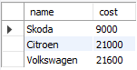
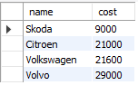
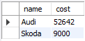
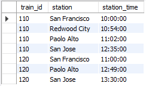
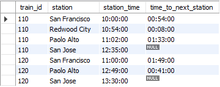

# Урок 5

## **SQL – оконные функции**

---

### **Основное ДЗ из презентации**

**Таблица cars.**

**1.    Создайте представление, в которое попадут автомобили стоимостью  до 25 000 долларов.**

---

**2.    Изменить в существующем представлении порог для стоимости: пусть цена будет до 30 000 долларов (используя оператор OR REPLACE).**

---

**3.    Создайте представление, в котором будут только автомобили марки “Skoda” и “Audi”.**

---

**Таблица train_shedule.**

---

**Добавьте новый столбец под названием «время до следующей станции».**
**Чтобы получить это значение, мы вычитаем время станций для пар смежных станций.**

- **Мы можем вычислить это значение  без использования оконной функции SQL, но это может быть очень сложно. Проще это сделать с помощью оконной функции LEAD. Эта функция сравнивает значения из одной строки со следующей строкой, чтобы получить результат. В этом случае функция сравнивает значения в столбце «время» для станции со станцией сразу после нее.**

---

### **Дополнительное задание**

**Для скрипта, поставленного в прошлом уроке (vk_db только с расширенными данными).**

- **Получите друзей пользователя с id=1 (решение задачи с помощью представления “друзья”).**

